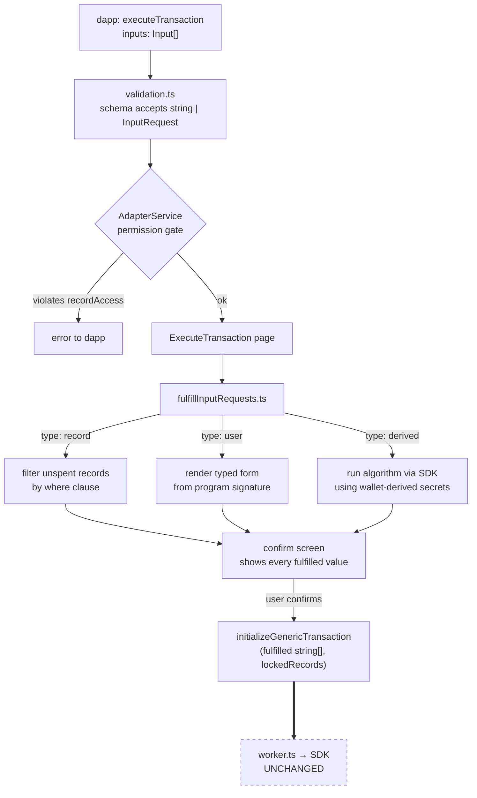

# Dapp input requests for `executeTransaction`

## Goal

Let dapps emit `TransactionOptions` whose `inputs` slots are not always literal Aleo values. Each non-literal slot is a **request** to the wallet — to prompt the user, to auto-select an owned record matching dapp-supplied criteria, or to compute a value by running a named cryptographic algorithm over the user's wallet state. The wallet fulfills the request before passing the transaction to the SDK.

## Wire-level types

```ts
type Input = string | InputRequest;

type InputRequest =
  | { type: "address"; label?: string } // Specification to fill the input field with the active address. Allowed in an input position with an aleo type of: `address, group, scalar, or field`.
  | { type: "record";  program: string; recordname: string; filters?: RecordFilters; uid?: string } // Specification to use a record of type `program/recordname`. `recordname` is required so the gate matches the request on the same `(program, recordname, field)` triple the grant model uses; without it, filter keys that collide across record types in the same program would be ambiguous. When `uid` is present, it pins the exact record previously returned by `requestRecords` and `filters` is ignored. When absent, the wallet picks any unspent record of `recordname` matching `filters`. Allowed in an input position with an aleo type of: `record, dynamic_record, or external_record`.
  | { type: "derived"; algorithm: AlgorithmName; args: Record<string, AlgorithmArg>; label?: string }; // Specification to fill the input field with the output of a wallet-evaluated cryptographic algorithm. Each algorithm declares its expected `args` schema and its output Aleo type; the output type determines which input positions are valid. Strictly opt-in — the wallet refuses every derived request whose (algorithm, program, function, inputPosition) tuple is not in the connection's `algorithmsAllowed`. See "Derived inputs" below.

type RecordFilters = Record<string, RecordFieldFilter>; // keys are top-level record field names or dotted paths into struct fields, e.g. "amount" or "data.amount".
type RecordFieldFilter = { eq?: string, gte?: string, lte?: string, neq?: string, }; // potential matching conditions, AND-combined.

interface RecordView {
  fields: Record<string, string>; // parsed structured form of the record's plaintext. Only fields the dapp has read access to are present; redacted fields are omitted (not present-with-undefined).
}

// Re-exports the existing LiteralType enum from `@provablehq/aleo-types` (`packages/aleo-types/src/data.ts`).
type LiteralType =
  | "address" | "bool" | "group"
  | "u8" | "u16" | "u32" | "u64" | "u128"
  | "i8" | "i16" | "i32" | "i64" | "i128"
  | "field" | "scalar" | "signature";

// New algorithms are added to this literal union as they're standardized. The `(string & {})` permits
// unknown values for forward-compat — the wallet validates against its own `algorithmsSupported()` list at runtime.
type KnownAlgorithm = "program-scoped-blinding-factor" | "program-scoped-blinded-address";
type AlgorithmName  = KnownAlgorithm | (string & {});

// Arg-level type: an Aleo literal type, or "string" for non-literal args (enums, identifiers).
type ArgType = LiteralType | "string";

interface AlgorithmArg {
  type: ArgType;  // parsing directive — the wallet decodes `value` as an Aleo literal (if LiteralType) or treats it as a plain string (if "string")
  value: string;  // an Aleo literal in canonical string form (e.g. "12345field", "100u64", "true"), or a plain string identifier/enum value when type is "string"
}

// A per-arg grant constraint: a fixed allowlist of acceptable values, or "any" (omitted ⇒ "any").
type ArgConstraint = string[] | "any";
```

`requestRecords` continues to return its existing wallet-defined record shape (e.g. Shield's `OwnedRecord` at `shield-extension/src/background/types/RecordScanner.ts:83`). Two optional fields are added additively to each returned record:

- `recordView?: RecordView` — structured form of the plaintext fields. Populated whenever the wallet decrypted the record. Saves dapps from reparsing Aleo-plaintext strings and is the only path through which redacted fields can be filtered out structurally. Optional in the type because pre-spec wallets won't emit it; conforming wallets always do when decryption ran.
- `uid?: string` — wallet-issued opaque handle, stable for the lifetime of the connection. Pass back as `uid` in a `type: "record"` request to pin this exact record. Not derived from the record's commitment, nonce, or tag; the wallet may rotate UIDs across connections to prevent cross-session linkability. Optional in the type for the same pre-spec reason; conforming wallets always populate it on every returned record regardless of grant breadth.

The remaining (legacy) fields — including `recordPlaintext`, `commitment`, `tag`, `transitionId`, `transactionId`, `owner`, `sender`, etc. — are exposed or stripped per the grant's breadth, defined in "Record read shape" below.

**Backwards compatibility.** A dapp that connected before this spec sees no shape change: it defaults to `recordAccess: undefined` (broadest grant), all legacy fields are populated as today, and the new `recordView` / `uid` fields are simply additive optional keys it can ignore. A dapp that opts into field-narrowing is by definition a new dapp aware of `uid` and `recordView`, so the legacy-stripping behavior in the matrix below is opt-in by construction — nothing breaks for existing consumers.

The `InputRequest` sends a request to the wallet (which is then authorized by the user) to do the following:
1. Input the user's address into a position where there's an address, group, scalar, or field input.
2. Use a record whose fields match the `filters` on specific record's members and filter for records that match them if applicable, returning an error if the condition cannot be applied or a record matching it cannot be found.
3. Run a named cryptographic algorithm over the wallet's state (view key, program-scoped counters, etc.) plus dapp-supplied arguments, and use the output as input. Authorized only at exact `(algorithm, program, function, inputPosition)` call sites.

The wallet has the program's source, so it reads a function's parameter signature for input position `i` and renders the form control accordingly. `label` is UX-only.

Adapters are ONLY allowed to successfully execute this if the user has authorized permission to do so.

## Permission model

### Today

`ConnectHistory` (`src/app/common/types/IAdapterService.ts:92`) carries `decryptPermission` plus a flat `programs?: string[]` allowlist. Two gates consult `programs` via `programs.includes(target)`: `executeTransaction` at `AdapterService.ts:240` and `requestRecords` at `:494`. Permissions are scoped per-dapp via `siteInfo.origin`; every gated method runs `getMatchingConnectHistoryAndDecryptPermission` (`:412-437`) first, which loads exactly one `ConnectHistory` row keyed on `(origin, network, address)`.

### Proposed

Add two new fields to `ConnectHistory`, both additive. The existing `decryptPermission` and `programs?: string[]` are preserved exactly, and the `connect()` signature does not change.

```ts
interface ConnectHistory {
  // ...existing fields...
  decryptPermission: DecryptPermission;         // unchanged
  programs?: string[];                          // unchanged — program-level gate for both transaction execution and record operations
  readAddress?: boolean;                        // new — opt-in address withholding; default true
  recordAccess?: RecordAccessGrant;             // new — opt-in record/field narrowing
  algorithmsAllowed?: AlgorithmGrant[];         // new — strict opt-in derived-input allowlist; default undefined → every `type: "derived"` request is refused
}

type RecordAccessGrant =
  | { level: "none" }
  | { level: "byProgram"; programs: ProgramGrant[] };

interface ProgramGrant {
  program: string;
  records?: RecordGrant[];   // undefined → all records of this program; present → only the listed records
}

interface RecordGrant {
  recordname: string;
  fields?: FieldGrant[];     // undefined → all fields; present → only the listed fields
}

interface FieldGrant {
  name: string;               // a record-body field name (e.g. "amount", "data.amount"), or a `$`-prefixed envelope-metadata name from the reserved set: `$commitment`, `$tag`, `$transitionId`, `$transactionId`, `$outputIndex`, `$transactionIndex`, `$transitionIndex`, `$owner`, `$sender`. The `$` prefix prevents collision with any body field named identically.
  readAccess?: boolean;       // undefined → true; false → field is usable as a filter key but plaintext is withheld on decrypt
}

// Each grant authorizes one specific call site. `algorithm`, `program`, `function`, and `inputPosition`
// are required and exact-match; there is no wildcard. A dapp that wants to use the same algorithm at
// multiple call sites lists each one as its own entry.
interface AlgorithmGrant {
  algorithm: AlgorithmName;                   // must appear in the wallet's `algorithmsSupported()` list
  program: string;                            // must also appear in `programs`
  function: string;                           // exact transition name within `program`
  inputPosition: number;                      // 0-based index into the function's input slots
  argConstraints?: Record<string, ArgConstraint>; // optional per-arg allowlist: for each arg name,
                                              // a fixed array of acceptable `AlgorithmArg.value` strings or "any".
                                              // Omitted ⇒ "any" for that arg. Enforced by the wallet.
}
```

| Configuration | Meaning |
|---|---|
| `recordAccess: undefined` | Today's broad behavior — all records of programs allowed by `programs`, all fields. |
| `recordAccess: { level: "none" }` | Refuse every `requestRecords` call and every `type: "record"` request. Transaction execution with literal inputs is unaffected. |
| `recordAccess: { level: "byProgram", programs: [...] }`, `ProgramGrant.records` undefined | All records of the listed program; all fields. |
| `recordAccess: { level: "byProgram", programs: [...] }`, `RecordGrant.fields` undefined | Only the listed records; all fields within them. |
| `recordAccess: { level: "byProgram", programs: [...] }`, `fields` listed | Only the listed records, and only the listed fields within each. |

### Backward compatibility

The pre-existing dapp surface is preserved exactly:

- **`connect()` signature unchanged**: still `(siteInfo, network, decryptPermission, programs?)`. A dapp that called `connect({ programs: ["foo.aleo"] })` before this change behaves identically after.
- **Existing gates unchanged**: the `programs.includes(program)` checks at `AdapterService.ts:240` and `:494` keep producing the same outcome for any connection where `recordAccess` is undefined.
- **`recordAccess` defaults to undefined**: the wallet never synthesizes a grant from the legacy `programs` list. `undefined` reads as "today's broad behavior."
- **Per-dapp scoping**: `recordAccess` lives on the `ConnectHistory` row keyed on `(origin, network, address)`; one dapp's grant never affects another's access. No change to today's scoping.

A strict opt-in security model would require an explicit grant for any record access. Keeping the default broad here is a deliberate trade-off to avoid breaking dapps that connected before `recordAccess` existed. Dapps that want narrower scopes opt in by populating `recordAccess` at connect time.

### Interaction rules

When `recordAccess` is set, these rules apply on top of the unchanged `programs` allowlist:

1. **Subset constraint**: every `recordAccess.programs[].program` must appear in `programs`. Connect-time validation rejects mismatches.
2. **Programs without record grants lose record access**: a program in `programs` but not in `recordAccess.programs[]` keeps transaction-execution access (literal inputs only). It cannot be queried via `requestRecords` and cannot be the target of a `type: "record"` request.
3. **Record narrowing**: when `ProgramGrant.records` is present, only the listed `recordname`s of that program are accessible. `undefined` → all records.
4. **Field narrowing**: when `RecordGrant.fields` is present, only the listed field names may be referenced as filter keys in a `type: "record"` request. `undefined` → all fields. Filter keys outside the listed fields are a permission error at the gate. Plaintext exposure is further controlled by `FieldGrant.readAccess`: when `readAccess` is `true` (or omitted, which defaults to `true`) the field's plaintext value is included in `requestRecords` decrypt output; when `false` the field remains usable as a filter key but its plaintext is redacted from decrypt results.
5. **`level: "none"`** refuses all record operations regardless of `programs`. Transaction execution with literal inputs is unaffected.

### Record read shape

`requestRecords` always emits `recordView` and `uid` on each returned record. Whether the wallet's pre-existing legacy fields (`recordPlaintext`, `commitment`, `tag`, `transitionId`, `transactionId`, `owner`, `sender`, indices, etc.) are populated depends on how narrowly the dapp's grant restricts access. The principle: legacy fields disclose record identity and ownership beyond what `recordView` would; once the grant says "you only get certain fields," disclosing the full plaintext or identity metadata would defeat the narrowing.

| Grant on the queried program | Legacy fields | `recordView.fields` |
|---|---|---|
| `recordAccess: undefined` (today's broad behavior) | All populated, unchanged from today. | All fields parsed. |
| `recordAccess: { level: "byProgram", programs: [{ program /* no records */}] }` | All populated, unchanged from today. | All fields parsed. |
| `ProgramGrant.records` present, `RecordGrant.fields` absent | All populated for records whose `recordname` is in the list; non-listed records are not returned. | All fields parsed. |
| `RecordGrant.fields` present | `recordPlaintext` is always stripped. Envelope metadata (`commitment`, `tag`, `transitionId`, `transactionId`, `outputIndex`, `transactionIndex`, `transitionIndex`, `owner`, `sender`) is stripped by default; each entry the dapp opts into via a `$`-prefixed `FieldGrant.name` is exposed. Non-identifying envelope fields (`programName`, `recordName`, `blockHeight`, `blockTimestamp`, `spent`) are preserved. | Only the listed body fields whose `FieldGrant.readAccess` is true (or omitted). |

Rationale: when the dapp asks for narrow field access, it has explicitly given up the broad read. Returning the unredacted `recordPlaintext` alongside a narrowed `recordView` would let the dapp re-parse the plaintext and bypass the narrowing — so legacy plaintext is always dropped here. Envelope metadata (`$commitment`, `$tag`, `$transitionId`, etc.) lets the dapp correlate records to on-chain state, so it is also opt-in: a privacy-preserving dapp lists only what it needs, and `uid` covers pinning even when no metadata is requested. A dapp that wants today's full disclosure simply lists the relevant `$`-prefixed names alongside its body-field grants.

Under `readAddress: false`, the strip rules tighten further independently of the grant: `owner`, `sender`, `commitment`, `tag`, `transitionId`, `transactionId`, and `recordPlaintext` are always omitted, and any `recordView.fields` whose Aleo type is `address` and whose plaintext equals the active address is omitted. `uid` and `recordView` (with non-address fields) remain the dapp's only handles to the record.

### Derived inputs

A `type: "derived"` request asks the wallet to compute a value by running a named cryptographic algorithm over the wallet's own state (the view key, a per-(origin, program) counter, etc.) combined with the dapp's `args`, then substitute the result into the input slot. The dapp never observes the wallet-side inputs — only the final output.

Derived inputs are **strictly opt-in**: the wallet refuses every derived request whose `(algorithm, program, function, inputPosition)` tuple is not present in `algorithmsAllowed`. There is no broad default. The four fields are required and exact-match — a grant for `(algorithm: X, program: "p.aleo", function: "f", inputPosition: 0)` does not authorize the same algorithm at `inputPosition: 1`, at a different function, or at a different program. A dapp that wants the same algorithm at multiple call sites lists each one as its own entry.

#### Discovery

Adapters expose `algorithmsSupported(): Promise<AlgorithmName[]>`. A dapp calls this before connect to learn which algorithms a wallet implements, then requests a matching subset in `algorithmsAllowed`. Wallets that don't implement derived inputs at all return an empty array or throw `MethodNotImplementedError`.

Every `algorithmsAllowed[].algorithm` is validated at connect time against the wallet's `algorithmsSupported()`. Unknown names are rejected.

#### Output type and slot compatibility

Each `KnownAlgorithm` has a fixed Aleo output type, declared in the catalog below. The wallet additionally validates at execute time that the function's signature at `inputs[i]` is a valid position for that output type — same rules as `type: "address"` (e.g. an `address`-typed output is valid in `address` / `group` / `scalar` / `field` slots).

#### Algorithm catalog

The program-scoped blinding scheme is two-stage and fills **two** circuit inputs from the same wallet-maintained counter: a private `blinding_factor` and a public `blinded_address` (which the contract re-derives and asserts). Each is produced by its own algorithm so a function can request only the slot it needs. Both consume the same `args`:

| Arg | Type | Notes |
|---|---|---|
| `mode` | `string` | `possibleValues: ["issue", "resolve"]`. `issue` (swap) advances the wallet's counter; `resolve` (claim) reuses the counter of a past derivation, selected by `targetAddress`. |
| `membershipProgram` | `string` | program holding the used-address mapping (usually the called program) |
| `membershipMapping` | `string` | mapping recording used blinded addresses; where the wallet probes to find a free counter (`issue`) or confirm existence (`resolve`) |
| `targetAddress` | `address` | **optional**; required only for `resolve` — the public blinded address being reclaimed |

The counter is wallet-owned and never observed or controllable by the dapp; on `resolve` the wallet inverts the public `targetAddress` to its counter internally — the counter never leaves the wallet.

##### `program-scoped-blinding-factor`

Output type `field` (the blinding factor `r`). Valid input slot positions: `field`, `scalar`, `group`.

##### `program-scoped-blinded-address`

Output type `address` (the blinded address). Valid input slot positions: `address`, `group`, `scalar`, `field`. Derives `r` internally so both slots agree on one counter.

Algorithm (pseudo, matching the wallet's reference implementation; `BF_DOMAIN`/`CS_DOMAIN` are fixed program-identifier field constants):

```
r            = Poseidon8.hash([programAddrField, BF_DOMAIN, viewKeyField, counterField])
blinded_addr = Address.fromGroup(Poseidon8.hashToGroup(bitpack252([programAddrField, CS_DOMAIN, signerField, r])))
```

The dapp never observes the view key, the counter, or `r`. The blinded address's link to the active address is hidden by `r` (which needs the view key) — recovering the active address from the output is computationally infeasible without it.

Future algorithms are added to `KnownAlgorithm` and documented under their own catalog subsection in this spec.

#### Interaction with `readAddress: false`

Derived inputs are allowed under `readAddress: false`. The dapp does not learn the active address through the derived flow — it only sees the algorithm's output. For `program-scoped-blinded-address` the output is itself a fresh blinded address, so it does not leak the active address even when the dapp inspects the resulting transaction. Algorithms whose output is the active address itself (or trivially reversible to it) must not be admitted to `KnownAlgorithm` for this reason.

#### Interaction with `programs`

`algorithmsAllowed[].program` must appear in `programs`. The wallet rejects mismatches at connect time. This mirrors the subset constraint already enforced for `recordAccess.programs[].program`.

### Address exposure

`readAddress?: boolean` controls whether the dapp learns the user's address. Defaults to `true` (undefined treated as `true`); `false` is opt-in for privacy-preserving dapps.

#### `readAddress: undefined | true` — current behavior, with notification

The dapp learns the address through the same paths as today. The only change is **UX**: the connect dialog adds an explicit line item disclosing that the dapp will see the address. The user already approves the connection itself; this surfaces what the approval implies. No API or return-type change.

#### `readAddress: false` — withholding

The dapp transacts on the user's behalf without learning the address. Every direct-exposure path is closed and every operation that would let the dapp enumerate, decrypt, or otherwise derive the address from wallet-mediated state is refused.

| Surface | Behavior under `readAddress: false`                                                                                                                                                                                                  |
|---|--------------------------------------------------------------------------------------------------------------------------------------------------------------------------------------------------------------------------------------|
| `connect()` return value (`Account.address`) | `""` (empty string) — type stays `string`                                                                                                                                                                                            |
| `provider._publicKey` getter | returns `""` regardless of connection state                                                                                                                                                                                          |
| `init` message handler | must not populate address; today's `undefined` already complies                                                                                                                                                                      |
| `decrypt(record)` | refused with permission error                                                                                                                                                                                                        |
| `requestRecords(program, includePlaintext?)` | allowed; address-leaking legacy fields and address-typed plaintext that match the wallet's address are stripped per "Record read shape". The dapp pins returned records via `uid` in a `type: "record"` request without ever learning the owner.                    |
| `transitionViewKeys(txid)` | refused with permission error (view keys derive the address via `address = view_key · G`)                                                                                                                                            |
| `requestTransactionHistory(program)` | refused with permission error (same view-key-derivation reasoning)                                                                                                                                                                   |
| `executeTransaction` with literal inputs | allowed                                                                                                                                                                                                                              |
| `executeTransaction` with `type: "address"` slot | allowed — the wallet injects the active address into the transaction; the dapp never observes it                                                                                                                                     |
| `signMessage(message)` | allowed — the signature plus message reveals the signer's public key, which is the address. The privacy guarantee leaks here by design; dapps that need a strict guarantee should not call `signMessage` under `readAddress: false`. |

#### Compatibility constraint with `decryptPermission`

Because every plaintext-bearing decrypt operation is refused under `readAddress: false`, the only coherent `decryptPermission` value is `NoDecrypt`. Connecting with `readAddress: false` together with `UponRequest`, `AutoDecrypt`, or `OnChainHistory` is a connect-time error.

#### Backward compatibility

The default (`undefined` or `true`) preserves today's behavior verbatim at every API surface. The connect-dialog notification is a UI-only change visible to the user, not the dapp. No existing dapp's wire calls or return values change.

## Fulfillment flow



The worker boundary still receives `string[]`. All fulfillment is wallet-side; the SDK call sites and the `imports` path are untouched.

## Failure modes

| Request | Condition | Result |
|---|---|---|
| `type: "record"` | zero matches for `where` | fail loudly (matches `imports` precedent) |
| `type: "record"` | filter key does not resolve to a field in the record's signature (including dotted struct paths) | validation error before gate |
| `type: "record"` | operator illegal for the field's Aleo type (e.g. `gte` on `boolean`) | validation error before gate |
| `type: "record"` | filter value does not parse as a literal of the field's Aleo type | validation error before gate |
| `type: "record"` | `gte` and `lte` form an empty range, or `eq` contradicts `neq` | validation error before gate |
| `type: "record"` | field outside `RecordGrant.fields` | permission error at gate |
| `type: "record"` | `uid` present but does not match a record previously returned to this dapp on this connection | permission error at gate |
| `type: "record"` | `uid` present and matches, but the record is now spent | fail loudly (matches `imports` precedent) |
| `type: "record"` | both `uid` and `filters` provided | validation error before gate (`uid` is exclusive) |
| `connect()` | `FieldGrant.name` uses an unknown `$`-prefixed token (not in the reserved set) | connect-time validation error |
| `connect()` | `FieldGrant.name` references a body field that does not exist in the record's signature | connect-time validation error |
| `connect()` | `FieldGrant` lists `$owner`, `$sender`, `$commitment`, `$tag`, `$transitionId`, or `$transactionId` while `readAddress: false` | connect-time validation error (these would re-leak the address or let the dapp link to on-chain state that does) |
| `connect()` | `recordAccess.programs[].program` not present in `programs` | connect-time validation error |
| `requestRecords` | called against a program in `programs` but absent from `recordAccess.programs[]` (when `recordAccess` is set) | permission error at gate |
| `requestRecords` | `includePlaintext: true` while `decryptPermission: NoDecrypt` | permission error at gate (today's behavior, restated) |
| `type: "derived"` | `(algorithm, program, function, inputPosition)` tuple not in `algorithmsAllowed` | permission error at gate |
| `type: "derived"` | `algorithm` not in the wallet's `algorithmsSupported()` list | permission error at gate (also caught at connect time if the dapp listed it in `algorithmsAllowed`) |
| `type: "derived"` | `args` missing a key required by the algorithm's schema, has an extra key, or an `AlgorithmArg.type` mismatches the algorithm's expected type for that key | validation error before gate |
| `type: "derived"` | `AlgorithmArg.value` does not parse as a literal of `AlgorithmArg.type` | validation error before gate |
| `type: "derived"` | algorithm output type incompatible with the function signature at `inputs[i]` (e.g. an `address`-producing algorithm used in a `u64` slot) | validation error before gate |
| `connect()` | `algorithmsAllowed[].program` not present in `programs` | connect-time validation error |
| `connect()` | `algorithmsAllowed[].algorithm` not in the wallet's `algorithmsSupported()` | connect-time validation error |
