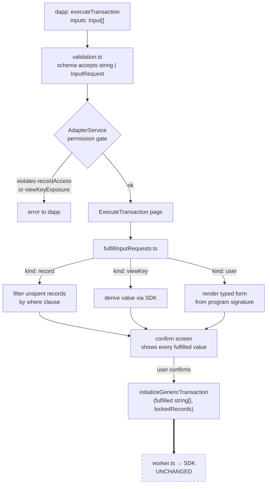

# Dapp input requests for `executeTransaction`

## Goal

Let dapps emit `TransactionOptions` whose `inputs` slots are not always literal Aleo values. Each non-literal slot is a **request** to the wallet — to prompt the user, to auto-select an owned record matching dapp-supplied criteria, or to derive a value from the user's view key. The wallet fulfills the request before passing the transaction to the SDK.

## Wire-level types

```ts
type Input = string | InputRequest;

type InputRequest =
  | { kind: "user"; label?: string } // Provides a form for the user to enter inputs. Only applies to .private inputs.
  | { kind: "address"; label?: string } // Specification to fill the input field with the active address, possible in an address, group, scalar, or field input.
  | { kind: "record";  program: string; filters?: RecordFilters } // Specification to use a record from a specific program with given filters.
  | { kind: "viewKey"; label?: string }; // Specification to fill the input field with the view key behind the active address, possible in a scalar or field input.

type RecordFilters = Record<string, RecordMatcher>;
type RecordMatcher = { eq?: string, gte?: string, lte?: string, neq?: string, }; // potential matching conditions.
```

The `InputRequest` sends a request to the wallet (which is then authorized by the user) to do the following:
1. Input the user's address into a position where there's an address, group, scalar, or field input.
2. Input a view key if where there's a field or scalar input.
3. Use a record whose fields match the `filters` on specific record's members and filter for records that match them if applicable, returning an error if the condition cannot be applied or a record matching it cannot be found.

The wallet has the program's source, so it reads a function's parameter signature for input position `i` and renders the form control accordingly. `label` is UX-only.

Adapters are ONLY allowed to successfully execute this if the user has authorized permission to do so.

## Permission model

### Today

`ConnectHistory` (`src/app/common/types/IAdapterService.ts:92`) carries `decryptPermission` plus a flat `programs?: string[]` allowlist used at `AdapterService.ts:494` as `programs.includes(program)`.

### Proposed

Replace `programs?: string[]` with a structured grant; add a separate `viewKeyExposure`.

```ts
interface ConnectHistory {
  // ...unchanged fields...
  decryptPermission: DecryptPermission;
  recordAccess?: RecordAccessGrant;
  viewKeyExposure?: "DENY" | "PER_TX_PROMPT";   // default DENY
}

type RecordAccessGrant =
  | { level: "none" }
  | { level: "anyProgram" }
  | { level: "byProgram"; programs: ProgramGrant[] };

interface ProgramGrant {
  program: string;
  records?: RecordName[], // Optional list of records and their fields which can be read. Undefined means all records for the program.
}

interface RecordGrant {
   recordname: string; // The name of the record in the program.
   fields: FieldGrant[] // The name of the field which can be read.
}

interface FieldGrant {
   name: string; // The name of the record field to require access to.
   read: true; // Whether or not this field is readable or the dapp can only request
}
```

| Level | Meaning | Maps to today |
|---|---|---|
| `none` | Refuse every `kind: "record"` request and `requestRecords` call. | New. |
| `anyProgram` | Records from any program. | `programs === undefined` |
| `byProgram` (no `records`) | Rcords only from listed programs. All records, all fields. | `programs: string[]` |
| `byProgram` (with `records`) | Within each program, only named records and fields can be read or requested access to. Empty fields in `RecordGrant` means all fields. | New. |

Legacy `programs: string[]` migrates to `{ level: "byProgram", programs: programs.map(p => ({ program: p })) }` once on read, in `DappStorage`.

Dapps can request usage of records via filters, but without 

### Independent rule for `kind: "user"`

A wallet only renders a user-input prompt for parameters declared `.private` in the program source. Public parameters must be supplied as literals by the dapp. Enforced statically in the resolver, not in `ConnectHistory`.

## Fulfillment flow



The worker boundary still receives `string[]`. All fulfillment is wallet-side; the SDK call sites and the `imports` path are untouched.

## Failure modes

| Request | Condition | Result |
|---|---|---|
| `kind: "record"` | zero matches for `where` | fail loudly (matches `imports` precedent) |
| `kind: "record"` | field outside `ProgramGrant.fields` | permission error at gate |
| `kind: "user"` | parameter declared `.public` | fulfillment error before prompting |
| `kind: "viewKey"` | `viewKeyExposure: "DENY"` | permission error at gate |
