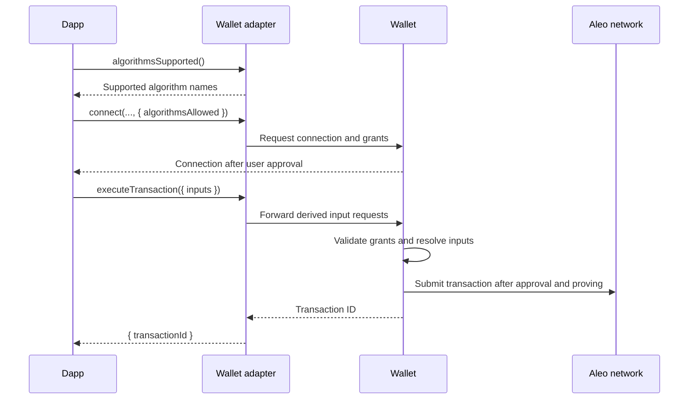

# Integrate wallet-hosted algorithms

This guide explains how an Aleo wallet can support derived transaction inputs through the Aleo Wallet Adapter. It covers the wallet implementation, the permissions a dapp requests, and the adapter calls that execute the transaction.

A wallet-hosted algorithm computes a transaction input inside the wallet. The dapp supplies an algorithm name and typed arguments. The wallet validates the request, computes the value using wallet-held state, and inserts the result into the transaction before proving and submission. This lets a dapp request a value derived from a user's view key without receiving that key or computing the value itself.

The examples cover `program-scoped-blinding-factor` and `program-scoped-blinded-address`, which supply Shield Swap's private swap and claim inputs. The implementation below requires no access to Shield's wallet source code or internal packages. Use adapter and wallet builds that implement these interfaces; package installation alone does not establish support.

For an interactive example, open the [Wallet Adapter demo's Private Inputs page](https://aleo-dev-toolkit-react-app.vercel.app/private-inputs) and configure a Shield Swap transaction as described in [Run the live demo](#run-the-live-demo).

## How a derived input works

A derived input occupies one position in the ordinary transaction `inputs` array:

```ts
{
  type: 'derived',
  algorithm: 'program-scoped-blinding-factor',
  args: {
    mode: { type: 'string', value: 'issue' },
    membershipProgram: { type: 'string', value: 'amm_v3.aleo' },
    membershipMapping: { type: 'string', value: 'used_blinded_addresses' },
  },
}
```

The algorithm is code installed and supported by the wallet. A dapp cannot submit executable code through this interface. The `args` object contains named arguments, each with a `type` and a string `value`.

The two blinding algorithms produce related values:

| Algorithm | Result | Use in a swap |
| --- | --- | --- |
| `program-scoped-blinding-factor` | Aleo `field` literal | Supplies the private blinding factor. |
| `program-scoped-blinded-address` | Aleo `address` literal | Supplies the public address identifying the swap. |

Both values derive from the same wallet-selected counter. The wallet derives the factor from the scope program's address, a fixed domain separator, the view-key scalar converted to a field, and the counter. It then derives the blinded address from the scope program's address, another fixed domain separator, the signer address, and the factor. A compatible contract can reproduce the second derivation from the signer and private factor and check that the supplied public address matches.

**The view key and counter MUST remain inside the wallet.** The adapter's `executeTransaction` response contains a transaction ID; it does not return the resolved inputs. A public blinded address can be observed through the resulting on-chain transaction or application state. The contract's input visibility determines which supplied values become public.



## Implement the wallet interface

### Implementation stack

Add derived inputs to the wallet's existing approval, signing, and proving flow.

| Component | Implementation |
| --- | --- |
| Adapter API | TypeScript interfaces from `@provablehq/aleo-types` and `@provablehq/aleo-wallet-standard`; validation through `@provablehq/aleo-wallet-adapter-core`. |
| Cryptography | `@provablehq/wasm` for Aleo types and Poseidon8. The example uses version `0.11.6`; select the build matching the connection's network. |
| Storage | Atomic counter reservations in IndexedDB/Dexie, SQLite, or an equivalent transactional database. |
| Network | `@provablehq/sdk` or the wallet's existing client for program source, mapping reads, submission, and transaction status. |

Shield uses TypeScript, WXT, React, Dexie, and Provable's SDK/WASM. Other wallets can retain their existing UI and transport. Run derivation inside the wallet and keep secret values out of page messages and logs.

### Provider and adapter responsibilities

The adapter carries dapp requests to the wallet. The wallet checks permissions and computes private inputs. Three methods expose this flow:

| Method | Wallet and adapter behavior |
| --- | --- |
| `algorithmsSupported(): Promise<string[]>` | Expose the names the wallet implements. Discovery must work before connection. |
| `connect(network, decryptPermission, programs?, options?)` | Forward, validate, and retain `options.algorithmsAllowed` as part of the approved connection. |
| `executeTransaction(options)` | Preserve structured `inputs`, enforce the approved grants, resolve derived slots, and return `{ transactionId }`. |

Preserve `InputRequest` objects when forwarding. Use `validateInputRequests` from `@provablehq/aleo-wallet-adapter-core` to catch malformed requests early. **The wallet MUST enforce permissions itself:** a dapp can call its provider directly and bypass adapter checks.

Discovery reports what the installed wallet implements. It lets the dapp check support before requesting permissions; the shared catalog alone does not establish support.

### Authorize each input position

A grant permits one algorithm at one `(program, function, inputPosition)`. This prevents a dapp from reusing permission at another input or function. Positions are zero-based; an empty or omitted `algorithmsAllowed` permits no derivation.

```ts
import type { AlgorithmGrant } from '@provablehq/aleo-wallet-standard';

const grant: AlgorithmGrant = {
  algorithm: 'program-scoped-blinding-factor',
  program: 'amm_v3.aleo',
  function: 'swap_private',
  inputPosition: 1,
  argConstraints: {
    mode: ['issue'],
    membershipProgram: ['amm_v3.aleo'],
    membershipMapping: ['used_blinded_addresses'],
  },
};
```

At connection, require a supported algorithm and a program in the `programs` allowlist. Bind the approved grants to the origin, account, and network. At execution, require an exact grant match and validate the arguments and target input type. Transaction approval still applies.

`argConstraints` limits argument values: an array allows only its entries; `'any'` or omission allows any valid value. `ALGORITHM_SCHEMAS` from `@provablehq/aleo-types` defines argument and slot types. Check those rules against the deployed function; these examples use `field` and `address` slots.

### Scope derivation to the intended program

The scope identifies the program used in derivation and counter storage. It defaults to the executing program. A wrapper can set `scopeProgram` so wrapped and direct calls produce matching values:

```ts
const wrapperGrant: AlgorithmGrant = {
  algorithm: 'program-scoped-blinded-address',
  program: 'amm_router.aleo',
  function: 'swap_from_wrapped',
  inputPosition: 3,
  scopeProgram: 'amm_v3.aleo',
};
```

Resolve `grant.scopeProgram ?? grant.program` from the approved grant. An explicit scope must be a valid program ID deployed on the connection's network. Use its address in hashing and its ID in storage. The wrapper needs execution permission; scoping alone does not require execution permission for the inner program.

Requests cannot override the scope. `membershipProgram` and `membershipMapping` select only the state to query. The target contract verifies the derived address; the wallet does not verify the wrapper's internal calls.

### Resolve both algorithms in one transaction session

A transaction session holds one matching factor/address pair. Both algorithms share `program-scoped-blinding` state, keyed by account, network, and scope program. Compute that state once so the two slots cannot select different counters.

Require identical arguments across both slots. Resolve them sequentially or synchronize access to shared state. Reject unknown arguments and invalid types, identifiers, or values.

| Argument | Declared type | Validation |
| --- | --- | --- |
| `mode` | `string` | Required; `issue` or `resolve`. |
| `membershipProgram` | `string` | Required program ID for the mapping lookup. |
| `membershipMapping` | `string` | Required mapping identifier. |
| `targetAddress` | `address` | Required for `resolve`; forbidden for `issue`. |

| Mode | Wallet behavior |
| --- | --- |
| `issue` | Find a counter whose address is absent from the membership mapping and is not locally pending. Reserve it atomically and derive both outputs. |
| `resolve` | Require `targetAddress`, verify its membership, and find the counter that reproduces it. Reuse that counter without allocating a new one. |

Claims recover the original counter by re-deriving its address. Verify cached counters; otherwise search candidates. This supports recovery on a new device without transferring the counter database.

The reference search stops after 1,000 consecutive absent addresses or counter 100,000. Recovery beyond those bounds requires extending the search. A failed mapping query must never count as an absent address.

### Track reservations through settlement

A reservation prevents concurrent approvals from selecting the same counter. The flow below connects input resolution to settlement: `issue` reserves a new counter; `resolve` recovers an existing one. Both produce one pair for the transaction.

```mermaid
sequenceDiagram
    participant W as Wallet transaction flow
    participant S as Derivation session
    participant DB as Reservation storage
    participant N as Aleo network

    W->>W: Validate grants, scope, and arguments
    W->>S: Resolve first derived slot
    alt issue: new swap
        S->>DB: Read pending and reusable counters
        S->>N: Check candidate address is unused
        N-->>S: Membership result
        S->>DB: Atomically reserve counter as pending, txId = null
        Note over S,DB: On conflict, select another counter and retry
    else resolve: claim existing swap
        S->>N: Verify targetAddress exists in membership mapping
        S->>DB: Look up its counter
        Note over S,N: Verify by re-derivation; search candidates on a cache miss
    end
    S->>S: Derive and cache factor/address pair
    S-->>W: Value for first slot
    W->>S: Resolve second derived slot
    S->>S: Require matching arguments; reuse cached pair
    S-->>W: Value for second slot

    W->>W: Fill inputs and request transaction approval
    alt Cancelled or abandoned before commit
        W->>DB: Release uncommitted issue reservation
    else Approved
        W->>DB: Attach submitting transaction ID to issue reservation
        W->>N: Prove and submit transaction
        N-->>W: On-chain transaction ID
        W->>DB: Replace temporary ID, if used
        alt Accepted
            W->>DB: Mark issue reservation confirmed
        else Definitively rejected or failed
            W->>DB: Mark issue reservation reverted
            Note over DB,N: Recheck chain state before reusing the counter
        else Outcome unknown or timed out
            W->>DB: Keep issue reservation pending
            W->>N: Continue checking transaction status
        end
    end
```

The settlement writes apply only to `issue`; a claim creates no new reservation. A definitive failure after commit but before broadcast also marks the reservation reverted. Releasing a session must never delete a committed reservation.

Keep reservations pending until the outcome is known; a timeout does not prove failure. Local storage coordinates one installation. The contract must enforce uniqueness across devices.

Store at least the following fields for each reservation:

```ts
type BlindingEntry = {
  accountAddress: string;
  network: string;
  scopeProgram: string;
  stateKey: 'program-scoped-blinding';
  counter: number;
  blindedAddress: string;
  status: 'pending' | 'confirmed' | 'reverted';
  txId: string | null;
};
```

Use a unique key on `(accountAddress, network, scopeProgram, stateKey, blindedAddress)` and index `txId`. In one database transaction, reserve an absent or reverted row as pending with `txId: null`. Pending or confirmed rows cause a conflict: select another counter. Release only uncommitted pending rows; apply terminal updates only to pending rows.

Recheck reverted counters for reuse, then search above the local maximum, starting at zero on a fresh installation. Skip on-chain or locally pending candidates. Counters must fit in `u32`; fail on exhaustion. Sequential search handles gaps left by cancelled transactions.

An entry at `membershipProgram/membershipMapping[blindedAddress]` means used, even if its value is `false`. Only absence means available. Retain used-address entries for recovery and distinguish network errors from missing entries.

After validation, replace derived requests with their output strings in a wallet-local input array. Keep the original requests for approval display, then prove and submit through the existing pipeline. Release uncommitted reservations on cancellation or preparation failure; reconcile submitted transactions after restart.

## Exact swap derivation

The wallet computes a recoverable private factor and the public address the swap contract checks. Both use Aleo's Poseidon8 with fixed domain constants that distinguish the two hashes:

```text
BF_DOMAIN = 42815354924796718559205719970686750292466968495484257field
CS_DOMAIN = 11835072102227764468342786961086432175093421716844963782363567713633field
```

The constants encode `amm_v3_blinding_factor` and `amm_v3_claim_or_swap`. Keep them unchanged across program names.

Let `P` be the x-coordinate of the scope program's Aleo address, `S` the x-coordinate of the signer's Aleo address, `V` the wallet view-key scalar converted to a field, and `C` the counter converted from `u32` to a field. Compute:

```text
r = Poseidon8.hash([P, BF_DOMAIN, V, C])
B = Address.fromGroup(
      Poseidon8.hashToGroup(pack252([P, CS_DOMAIN, S, r]))
    )
```

`r` is the private blinding factor. `B` is the public blinded address. The first hash receives four fields directly. Only the second hash uses `pack252`.

`pack252` matches Aleo's raw `[field; 4u32]` encoding. Concatenate four full 253-bit little-endian field representations, then split the 1,012 bits into chunks of `252, 252, 252, 252, 4` bits. Convert each chunk to a field in little-endian order. Truncating individual fields or hashing text produces a different address and fails the contract check.

### TypeScript implementation

This implementation uses public WASM exports. For mainnet, import `@provablehq/wasm/mainnet.js`. The wallet supplies the approved scope's program address and active account's view-key scalar and signer address.

```ts
import {
  Address, Field, Poseidon8, Scalar, U32,
} from '@provablehq/wasm/testnet.js';

const BF_DOMAIN = '42815354924796718559205719970686750292466968495484257field';
const CS_DOMAIN =
  '11835072102227764468342786961086432175093421716844963782363567713633field';

function addressField(address: string): Field {
  return Address.from_string(address).toGroup().toXCoordinate();
}

function pack252(fields: Field[]): Field[] {
  const bits = fields.flatMap(field => field.toBitsLe());
  const packed: Field[] = [];
  for (let offset = 0; offset < bits.length; offset += 252) {
    packed.push(Field.fromBitsLe(bits.slice(offset, offset + 252)));
  }
  return packed;
}

export function deriveSwapInputs(
  programAddress: string,
  viewKeyScalar: string,
  signerAddress: string,
  counter: number,
): { blindingFactor: string; blindedAddress: string } {
  if (!Number.isInteger(counter) || counter < 0 || counter > 0xffff_ffff) {
    throw new Error('Counter must be an integer from 0 through 4294967295');
  }

  const blindingFactor = new Poseidon8().hash([
    addressField(programAddress),
    Field.fromString(BF_DOMAIN),
    Scalar.fromString(viewKeyScalar).toField(),
    U32.fromString(`${counter}u32`).toField(),
  ]).toString();

  // Allocate fresh fields: hashing can consume WASM input handles.
  const packed = pack252([
    addressField(programAddress),
    Field.fromString(CS_DOMAIN),
    addressField(signerAddress),
    Field.fromString(blindingFactor),
  ]);
  const blindedAddress = Address.fromGroup(
    new Poseidon8().hashToGroup(packed),
  ).toString();

  return { blindingFactor, blindedAddress };
}
```

Use `Program.fromString(programSource).address().toString()` for the approved scope on the active network. WASM `0.11.6` exposes `ViewKey.from_string(viewKey).to_scalar().toString()` for the wallet's view-key scalar. Reuse the pair for both slots and discard secret-bearing state after fulfillment.

Native bindings may represent bits as bytes or groups as strings. Normalize those values to preserve the same arithmetic and encoding, and follow the bindings' object-lifetime rules.

### Compatibility test vector

Use this testnet WASM `0.11.6` vector to check compatibility. It uses a public test scalar, the program below, and `Address.fromGroup(Group.generator())` as signer.

```aleo
program derivation_test.aleo;
function identity:
    input r0 as field.public;
    output r0 as field.public;
```

```json
{
  "programAddress": "aleo1x7kxvcemxhlsd7x7wapwdjuyav0h6yvpe76e8fs9hmf3t53apq9s7tkyfw",
  "signerAddress": "aleo1c4ymujuysflp8uurmk5n8zrquur9pyqdhz2ty9s82prs96eydqpsfrahgf",
  "viewKeyScalar": "1scalar",
  "counter": 0,
  "blindingFactor": "1486597362053800819779203635782691618849211330039711566246697090413632396910field",
  "blindedAddress": "aleo1dqleg6zkf2ca05ctxvjynzuvc4chtlqkr00m7c5yssfn7n6pd5xqj090t2"
}
```

Both outputs must match exactly. Compare packing with `Plaintext.fromString('[P, CS_DOMAIN, S, r]').toFieldsRaw()`, substituting field literals. Test permissions, reservations, and submission separately.

### Contract verification

This closure checks that the public address matches the signer and private factor. Inputs are the scope program's address, `self.signer`, factor, and blinded address:

```aleo
closure verify_blinded_address:
    input r0 as address;
    input r1 as address;
    input r2 as field;
    input r3 as address;
    cast r0 into r4 as field;
    cast r1 into r5 as field;
    cast r4 11835072102227764468342786961086432175093421716844963782363567713633field r5 r2 into r6 as [field; 4u32];
    hash.psd8.raw r6 into r7 as address;
    assert.eq r7 r3;
```

The contract checks the second hash; the wallet's first hash enables recovery without exposing the view key or counter. Swap finalization prevents reuse by checking and recording the address in `used_blinded_addresses`.

## Call the wallet adapter

The dapp discovers support, requests grants, then submits derived inputs. These examples use an installed `adapter` and illustrative `amm_v3.aleo` deployment. Match program IDs and input positions to the deployed contract. `tokenInput` is a `TransactionInput`; `remainingInputs` follows contract order.

### Discover support and request grants

```ts
import { Network, type TransactionInput } from '@provablehq/aleo-types';
import { DecryptPermission } from '@provablehq/aleo-wallet-adapter-core';
import type { AlgorithmGrant } from '@provablehq/aleo-wallet-standard';

const factor = 'program-scoped-blinding-factor';
const address = 'program-scoped-blinded-address';
const program = 'amm_v3.aleo';
const mapping = 'used_blinded_addresses';

const supported = await adapter.algorithmsSupported();
if (![factor, address].every(name => supported.includes(name))) {
  throw new Error('The selected wallet does not support both blinding algorithms');
}

const sites = [
  { function: 'swap_private', mode: 'issue', positions: [1, 2] },
  { function: 'claim_swap_output_private', mode: 'resolve', positions: [0, 1] },
] as const;

const algorithmsAllowed: AlgorithmGrant[] = sites.flatMap(site =>
  [factor, address].map((algorithm, index) => ({
    algorithm,
    program,
    function: site.function,
    inputPosition: site.positions[index]!,
    argConstraints: {
      mode: [site.mode],
      membershipProgram: [program],
      membershipMapping: [mapping],
    },
  })),
);

await adapter.connect(Network.TESTNET, DecryptPermission.NoDecrypt, [program], {
  algorithmsAllowed,
});
```

Swap and claim need separate grants because they call different functions. Wallet-selected records also need record permissions.

In React, configure `AleoWalletProvider` with these grants, `programs`, `network`, and `decryptPermission`; call discovery, connection, and execution through `useWallet()`. Select a wallet first: discovery returns `[]` without one. The hook's `connect(network)` forwards the provider's permissions.

### Issue a swap

```ts
const issueArgs = {
  mode: { type: 'string', value: 'issue' },
  membershipProgram: { type: 'string', value: program },
  membershipMapping: { type: 'string', value: mapping },
} as const;

const inputs: TransactionInput[] = [
  tokenInput,
  { type: 'derived', algorithm: factor, args: issueArgs },
  { type: 'derived', algorithm: address, args: issueArgs },
  ...remainingInputs,
];

const { transactionId } = await adapter.executeTransaction({
  program,
  function: 'swap_private',
  inputs,
});
```

The wallet fills positions 1 and 2. Track `transactionStatus(transactionId)` and obtain the public blinded address from the accepted transaction or indexed swap state for the later claim.

### Claim an existing swap

```ts
const resolveArgs = {
  mode: { type: 'string', value: 'resolve' },
  membershipProgram: { type: 'string', value: program },
  membershipMapping: { type: 'string', value: mapping },
  targetAddress: { type: 'address', value: targetAddress },
} as const;

const claim = await adapter.executeTransaction({
  program,
  function: 'claim_swap_output_private',
  inputs: [
    { type: 'derived', algorithm: factor, args: resolveArgs },
    { type: 'derived', algorithm: address, args: resolveArgs },
    ...remainingClaimInputs,
  ],
});
```

`targetAddress` identifies the existing swap; `remainingClaimInputs` supplies its other claim inputs. The wallet recovers the original pair at positions 0 and 1 without exposing the counter.

## Handle unsupported requests and failures

Explicit errors let the dapp explain whether to change wallets or correct a request. An unsupported adapter returns `[]` from discovery and uses these errors from `@provablehq/aleo-wallet-adapter-core`:

| Request | Error |
| --- | --- |
| Unsupported algorithm grants | `WalletConnectOptionsNotSupportedError` |
| Unsupported structured inputs | `WalletInputRequestNotSupportedError` |
| Malformed inputs | `WalletInputRequestInvalidError` |

Preserve user rejection as cancellation. Require a supported wallet rather than silently moving private derivation into the dapp.

Test denied grants, mismatched paired arguments, concurrent reservations, cancellation, submission failure, ID remapping, and recovery with empty storage. Check that responses and logs exclude private values.

## Run the live demo

The [Private Inputs demo](https://aleo-dev-toolkit-react-app.vercel.app/private-inputs) shows the grant and transaction flow with Shield. It defaults to a credits transfer; configure it for a deployed Shield Swap program. A swap needs an existing pool, an eligible token record, and fee funds.

1. Select the deployment's network and add the swap and token programs to **Programs**. Under **Function inputs**, enter the deployed program ID and `swap_private`.
2. Add algorithm grants for the factor at position 1 and address at position 2, plus access to the input token record. Confirm indices against the deployed function: form labels #2 and #3 correspond to zero-based grant positions 1 and 2.
3. Select **Apply grants & disconnect**, then reconnect Shield to approve them. **JSON preview** provides the dapp's provider configuration.
4. Set both slots to **Derived (wallet computes)**. Select their algorithms and use `mode: issue`, the deployed program as `membershipProgram`, and `used_blinded_addresses` as `membershipMapping`. Complete the remaining transaction inputs.
5. Select **Execute** and review the wallet approval. Track acceptance and obtain the public blinded address from the transaction or swap state.
6. To claim, select `claim_swap_output_private`, add its grants, and reconnect. Use `mode: resolve` and the swap's address as `targetAddress` in both slots; complete the remaining claim inputs.

Replace the illustrative `amm_v3.aleo` ID with the actual deployment. Wrapper calls also require the appropriate `scopeProgram` grant.

## Public integration resources

- [Wallet Adapter live demo](https://aleo-dev-toolkit-react-app.vercel.app/private-inputs)
- [Dapp API and derived-input guide](https://github.com/ProvableHQ/aleo-dev-toolkit/blob/master/docs/privacy-preserving-dapps.md)
- [Shared input types and algorithm schemas](https://github.com/ProvableHQ/aleo-dev-toolkit/blob/master/packages/aleo-types/src/transaction.ts)
- [Connection grant definitions](https://github.com/ProvableHQ/aleo-dev-toolkit/blob/master/packages/aleo-wallet-standard/src/wallet.ts)
- [Demo application source](https://github.com/ProvableHQ/aleo-dev-toolkit/tree/master/examples/react-app)
- [Provable SDK and WASM source](https://github.com/ProvableHQ/sdk)
