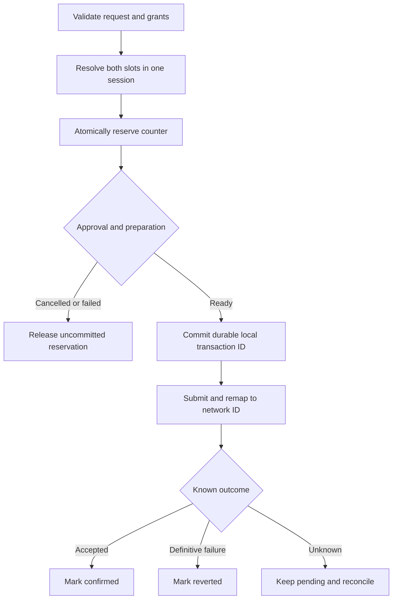

# Integrate wallet-hosted algorithms

This guide explains how to add private swap inputs to an Aleo wallet and request them through the Wallet Adapter. The wallet computes these inputs from the account's view key, so the dapp can request a swap without receiving the key.

A wallet-hosted algorithm is a function installed in the wallet. The dapp identifies the function by name and supplies typed arguments. The wallet checks permission, computes the value, and fills the transaction input before proving.

`@provablehq/aleo-wallet-algorithms` implements the swap calculations with SDK 0.11.11. Import each algorithm separately; bundles can omit unused algorithms, reservation helpers, and storage. The wallet can keep its existing counter and database logic.

Start with the [runnable browser example](../examples/wallet-algorithms). Its [integration notes](../examples/wallet-algorithms/INTEGRATION.md) explain how to handle provider requests and store reservations. The [blinding reference](../packages/aleo-wallet-algorithms/docs/program-scoped-blinding.md) covers both algorithms, their exact calculations and compatibility vector, and the optional lifecycle helpers.

## Implement in the wallet

1. **Expose support.** Return supported names from `algorithmsSupported()` before connection. Preserve structured transaction inputs through the provider and adapter.
2. **Approve permissions.** A grant permits an algorithm at a specific transaction input. Accept `connect(..., { algorithmsAllowed })` and bind approved permissions to origin, account, and network. At execution, match algorithm, program, function, and input position; enforce argument constraints and deployed input types.
3. **Select the scope program.** The scope program identifies the contract used in derivation. Use `grant.scopeProgram ?? grant.program`. Load that program on the connection's network and use its address for hashing. Supply the active account's signer address and view-key scalar inside the wallet.
4. **Compute the inputs.** Call the algorithms with a wallet-selected counter, or use a session to select and reserve one counter for both inputs. Both algorithms must use the same counter and arguments.
5. **Submit and track the outcome.** Replace requests with literals inside the wallet's existing approval, proving, and submission flow. Return a transaction ID through the adapter. Keep the view key, counter, and private factor inside the wallet; the contract determines which transaction values become public.

| Algorithm                        | Output    | Purpose                                                                      |
| -------------------------------- | --------- | ---------------------------------------------------------------------------- |
| `program-scoped-blinding-factor` | `field`   | Recoverable private swap factor derived from program, view key, and counter. |
| `program-scoped-blinded-address` | `address` | Public swap identifier derived from program, signer, and factor.             |

Import from `/mainnet/...` for mainnet; default exports use testnet. The package handles SDK calculations. The wallet retains control of its UI, transport, permissions, storage, and transaction pipeline. Schema validation alone does not grant permission.

## Optional reservation flow

A session makes both inputs use the same counter. A reservation prevents another transaction from selecting that counter while approval or submission is pending. Store reservations with the included IndexedDB adapter or implement `ReservationStore` using the wallet's existing database.



Release the session after submission to clear its cached values. Committed reservations remain pending until the wallet records a known outcome. **A timeout MUST NOT release a submitted transaction's reservation.** On restart, the wallet checks pending transaction IDs against the network.

Before reusing a reverted counter, check that its address is absent from the contract's used-address mapping. A claim uses `mode: resolve` to recover the original inputs without reserving another counter.

## Call the wallet adapter

The dapp discovers support, requests grants, then submits derived inputs. These examples use an installed `adapter` and illustrative `amm_v3.aleo` deployment. Match program IDs and input positions to the deployed contract. `tokenInput` is a `TransactionInput`; `remainingInputs` follows contract order.

### Discover support and request grants

```ts
import { Network, LiteralType, type TransactionInput } from '@provablehq/aleo-types';
import { DecryptPermission } from '@provablehq/aleo-wallet-adapter-core';
import type { AlgorithmGrant } from '@provablehq/aleo-wallet-standard';

const factor = 'program-scoped-blinding-factor';
const address = 'program-scoped-blinded-address';
const program = 'amm_v3.aleo';
const mapping = 'used_blinded_addresses';

const supported = await adapter.algorithmsSupported();
if (![factor, address].every(name => supported.includes(name))) {
  throw new Error('The selected wallet does not support both blinding algorithms');
}

const sites = [
  { function: 'swap_private', mode: 'issue', positions: [1, 2] },
  { function: 'claim_swap_output_private', mode: 'resolve', positions: [0, 1] },
] as const;

const algorithmsAllowed: AlgorithmGrant[] = sites.flatMap(site =>
  [factor, address].map((algorithm, index) => ({
    algorithm,
    program,
    function: site.function,
    inputPosition: site.positions[index]!,
    argConstraints: {
      mode: [site.mode],
      membershipProgram: [program],
      membershipMapping: [mapping],
    },
  })),
);

await adapter.connect(Network.TESTNET, DecryptPermission.NoDecrypt, [program], {
  algorithmsAllowed,
});
```

Swap and claim need separate grants because they call different functions. Wallet-selected records also need record permissions.

In React, configure `AleoWalletProvider` with these grants, `programs`, `network`, and `decryptPermission`; call discovery, connection, and execution through `useWallet()`. Select a wallet first: discovery returns `[]` without one. The hook's `connect(network)` forwards the provider's permissions.

### Issue a swap

```ts
const issueArgs = {
  mode: { type: 'string', value: 'issue' },
  membershipProgram: { type: 'string', value: program },
  membershipMapping: { type: 'string', value: mapping },
} as const;

const inputs: TransactionInput[] = [
  tokenInput,
  { type: 'derived', algorithm: factor, args: issueArgs },
  { type: 'derived', algorithm: address, args: issueArgs },
  ...remainingInputs,
];

const { transactionId } = await adapter.executeTransaction({
  program,
  function: 'swap_private',
  inputs,
});
```

The wallet fills positions 1 and 2. Track `transactionStatus(transactionId)` and obtain the public blinded address from the accepted transaction or indexed swap state for the later claim.

### Claim an existing swap

```ts
const resolveArgs = {
  mode: { type: 'string', value: 'resolve' },
  membershipProgram: { type: 'string', value: program },
  membershipMapping: { type: 'string', value: mapping },
  targetAddress: { type: LiteralType.ADDRESS, value: targetAddress },
} as const;

const claim = await adapter.executeTransaction({
  program,
  function: 'claim_swap_output_private',
  inputs: [
    { type: 'derived', algorithm: factor, args: resolveArgs },
    { type: 'derived', algorithm: address, args: resolveArgs },
    ...remainingClaimInputs,
  ],
});
```

`targetAddress` identifies the existing swap; `remainingClaimInputs` supplies its other claim inputs. The wallet recovers the original blinded address and factor at positions 0 and 1 without exposing the counter.

## Run the live demo

The [Private Inputs demo](https://aleo-dev-toolkit-react-app.vercel.app/private-inputs) shows the grant and transaction flow with Shield. It defaults to a credits transfer; configure it for a deployed private swap program that uses blinded addresses. A swap needs an existing pool, an eligible token record, and fee funds.

1. Select the deployment's network and add the swap and token programs to **Programs**. Under **Function inputs**, enter the deployed program ID and `swap_private`.
2. Add algorithm grants for the factor at position 1 and address at position 2, plus access to the input token record. Confirm indices against the deployed function: form labels #2 and #3 correspond to zero-based grant positions 1 and 2.
3. Select **Apply grants & disconnect**, then reconnect Shield to approve them. **JSON preview** provides the dapp's provider configuration.
4. Set both slots to **Derived (wallet computes)**. Select their algorithms and use `mode: issue`, the deployed program as `membershipProgram`, and `used_blinded_addresses` as `membershipMapping`. Complete the remaining transaction inputs.
5. Select **Execute** and review the wallet approval. Track acceptance and obtain the public blinded address from the transaction or swap state.
6. To claim, select `claim_swap_output_private`, add its grants, and reconnect. Use `mode: resolve` and the swap's address as `targetAddress` in both slots; complete the remaining claim inputs.

Replace the illustrative `amm_v3.aleo` ID with the actual deployment. Wrapper calls also require the appropriate `scopeProgram` grant.
