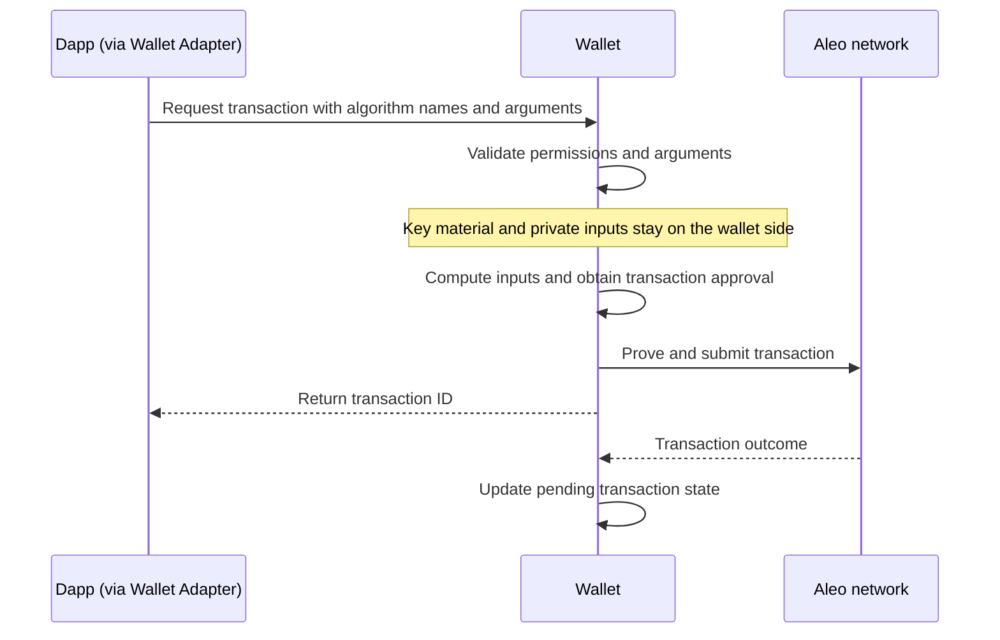

# Aleo wallet algorithms

Wallet-hosted algorithms are named computations that a wallet performs on behalf of a dapp. They let private applications derive transaction inputs from key material or private account data without exposing those secrets to the application.

The Aleo wallet-hosted algorithm standard gives dapps a common way to request these privacy-preserving computations from compatible wallets. The wallet checks permission and runs the requested algorithm using account data held inside the wallet. This allows applications in the Aleo ecosystem to use private computations through a shared interface.

`@provablehq/aleo-wallet-algorithms` provides reusable implementations of these algorithms for wallet providers interacting with Aleo dapps. **Aleo wallet providers SHOULD implement this standard** so private applications can request the same computations across wallets while account secrets remain protected. The package supplies the calculations; providers integrate them into their permission, approval, and transaction handling.

## How a request works

A derived transaction input expresses that request as an algorithm name and typed arguments. The wallet checks permission, supplies the required account values internally, and inserts the result into the transaction before proving. The adapter returns a transaction ID rather than the resolved private inputs. The contract determines which transaction values become public.

Shared implementations let wallet providers support the same algorithms without independently reproducing their cryptographic rules. Matching the expected hashing and encoding matters both for contract verification and for recovering values later. The package supplies the calculations and compatibility tests; the wallet enforces permissions and keeps secret inputs within its execution context.

### Request lifecycle



The dapp requests computations; the wallet supplies the secrets and runs them. Key material and resolved private inputs are never returned through the adapter. Rejected requests return an error without submission. The contract determines which values become public on chain.

## Included algorithms

| Algorithm                        | Where and why it is used                                                                                                   | Reference                                                                       |
| -------------------------------- | -------------------------------------------------------------------------------------------------------------------------- | ------------------------------------------------------------------------------- |
| `program-scoped-blinding-factor` | Creates the private factor behind a blinded address for a private swap and lets the wallet recover it for a later claim.   | [Inputs and exact calculation](docs/program-scoped-blinding.md#blinding-factor) |
| `program-scoped-blinded-address` | Creates the blinded address that publicly identifies a private swap; the contract checks it against the signer and factor. | [Inputs and exact calculation](docs/program-scoped-blinding.md#blinded-address) |

## Add the package to the wallet

```sh
pnpm add @provablehq/aleo-wallet-algorithms
```

## What's in the package

| Component                                                                            | What it provides                                                     | When to use it in a wallet                                                           |
| ------------------------------------------------------------------------------------ | -------------------------------------------------------------------- | ------------------------------------------------------------------------------------ |
| [Algorithms](#included-algorithms)                                                   | Calculations that use wallet-held account data.                      | A dapp requests a supported computation that needs private inputs.                   |
| [Sample lifecycle helpers](docs/program-scoped-blinding.md#sample-lifecycle-helpers) | Coordination of related inputs and their use during a transaction.   | Handling concurrent requests, cancellation, or recovery for the included algorithms. |
| [Storage adapters](docs/program-scoped-blinding.md#storage-adapters)                 | An IndexedDB implementation and an interface for existing databases. | The wallet needs to remember pending operations after closing or restarting.         |
| [Argument validation](src/schemas.ts)                                                | Checks for supported argument types and values.                      | Before computing a requested input. The wallet must also check permissions.          |
| [Testing utilities](src/testing.ts)                                                  | Known input/output pairs and checks for storage implementations.     | Verifying algorithm results or connecting the helpers to the wallet's database.      |

Lifecycle and storage helpers are optional; wallets can use the algorithms with their existing transaction handling.

## Integration example

The [browser example](../../examples/wallet-algorithms) shows the algorithms called directly, then combines argument validation, lifecycle helpers, and IndexedDB to handle a transaction from preparation through cancellation or completion. Reloading demonstrates saved state; recovery demonstrates recreating inputs without a saved local index.

The example uses the testing utilities for known inputs and outputs, an empty in-memory store for recovery, and checks of database behavior. Calculations and storage are real; account data is public test data and network outcomes are simulated.

Follow the [example README](../../examples/wallet-algorithms/README.md) to run it and the [integration guide](../../examples/wallet-algorithms/INTEGRATION.md) to connect these pieces to an existing wallet.
